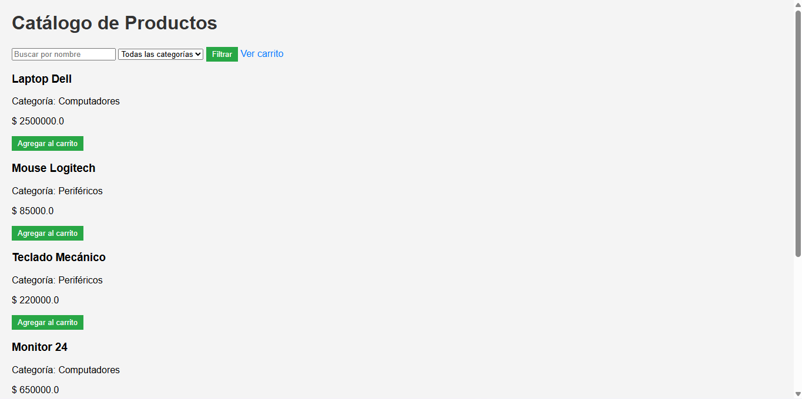
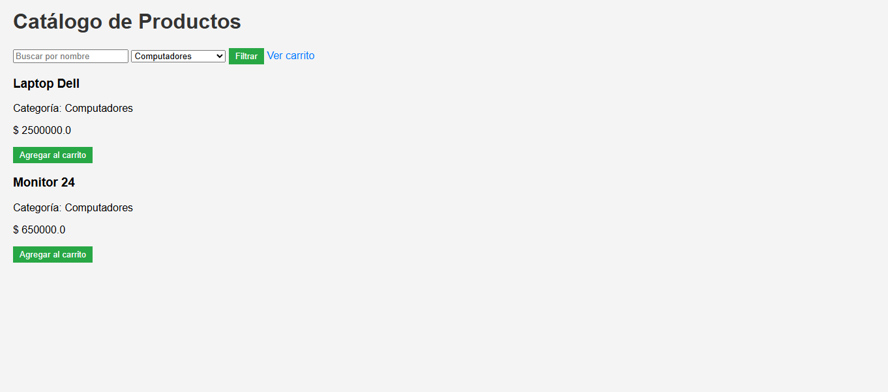
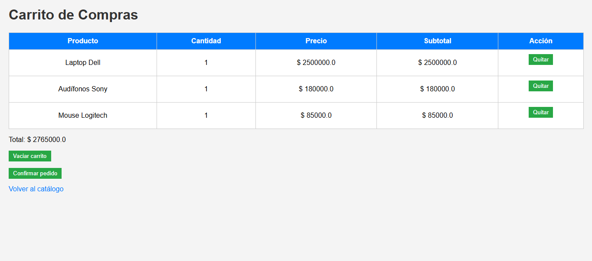
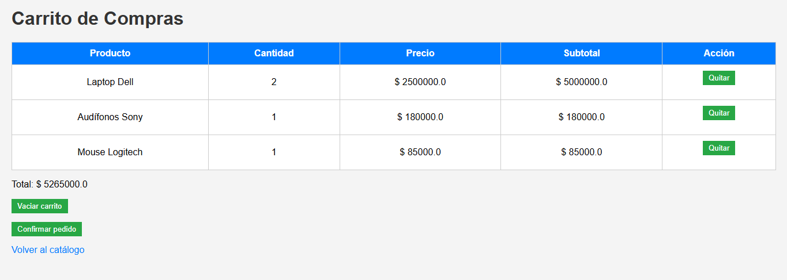

## Catalogo Web 
## Descripcion 
Este proyecto es una aplicación web desarrollada en Java utilizando Servlets y JSP. Permite visualizar un catálogo de productos, agregarlos a un carrito de compras y gestionar los productos seleccionados mediante sesión.

El sistema implementa conceptos básicos de desarrollo web en Java como:

- Servlets
- JSP
- Manejo de sesiones
- Arquitectura MVC básica

## Ejecucion 
- Clonar el repositorio
- Abrir el proyecto en IntelliJ IDEA
- Configurar el servidor Apache Tomcat
- Ejecutar el proyecto con Smart Tomcat
- Abrir en el navegador:

http://localhost:8080/catalogo-web/catalogo

## Capturas 

